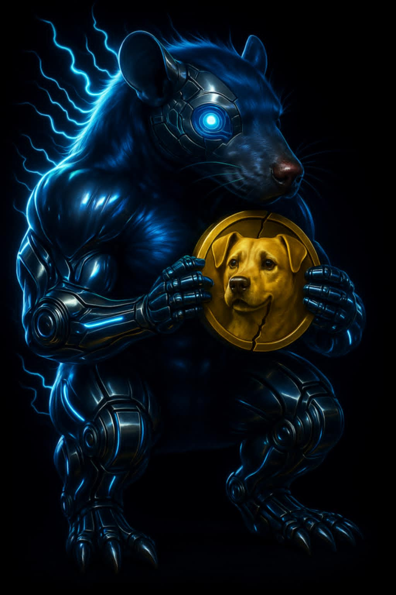

# FURAI – The golden meme

FURAI is the golden meme with an extremely low supply. For a meme. Created so everyone profits, not just the developers.

## Total Supply

*120 million FURAI*, distributed as follows:

- 20% reserved for the creator  
- 20% reserved for future partnerships and listings  
- 60% allocated to DEX liquidity  

🔒 **Note:**  
Each percentage is held in a separate public wallet.  
The creator’s wallet will be sold in 3 separate stages.  
The partnerships and listings wallet will be locked for 1 year.  
The DEX liquidity wallet will be split across multiple decentralized exchanges.

## Objective

To create an ecosystem of value and engagement around the FURAI token, encouraging usage, trading, and organic promotion.

## Logo

